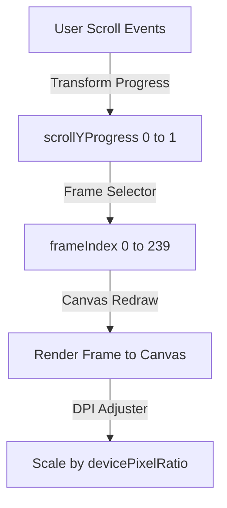
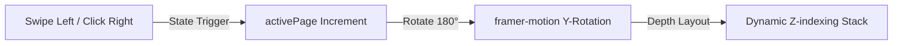

# <p align="center"></p>

<p align="center">
  <a href="https://github.com/Padmanaban29072004" target="_blank">
    
  </a>
  <a href="https://linkedin.com" target="_blank">
    
  </a>
  <a href="http://localhost:3000" target="_blank">
    
  </a>
</p>

---

## ⚡ Overview

Welcome to the source repository for my professional portfolio. This website is built to stand out with immersive visual storytelling, featuring a high-performance **Cinematic Scrolling Canvas Engine** (rendering fluid image sequences at high resolution) and an interactive **3D Page-Flip Book Gallery**.

---

## 🎨 Design & Key Features

* **Cinematic Hero Scroll**: A hardware-accelerated, high-fidelity scroll-driven canvas rendering an image sequence.
* **Retina / High-DPI Support**: Automatically scales the canvas's rendering buffer to match screen `devicePixelRatio` for razor-sharp visuals on all screens.
* **Performance Optimized**: Features WebP-optimized animation frames running with high-quality Lanczos scaling—cutting assets down from **43MB** to just **5.8MB** while quadrupling pixel clarity.
* **Interactive 3D Book Gallery**: A custom page-flip animation allowing users to swipe or click through milestones like folders in a 3D environment.
* **Modern dark theme aesthetics**: Clean spacing, glassmorphic navigations, Outfit-inspired typography, and orange glow styling.

---

## 🛠️ Tech Stack

<div align="center">

| Area | Technologies |
| :--- | :--- |
| **Frontend Core** |    |
| **Animation & Style** |   |
| **Asset Optimization** |   |
| **Deployment** |  |

</div>

---

## 📈 System Architecture

### 🎥 Cinematic Scroll Engine



### 📖 Interactive 3D Book Gallery



---

## 🚀 Getting Started

To run the development server locally, follow these steps:

### Prerequisites
- Node.js (v18.0.0 or higher)
- npm (v9.0.0 or higher)

### Setup Instructions

1. **Clone the Repository:**
   ```bash
   git clone https://github.com/Padmanaban29072004/padmanaban-website-main.git
   cd padmanaban-website-main
   ```

2. **Install Dependencies:**
   ```bash
   npm install
   ```

3. **Start Development Server:**
   ```bash
   npm run dev
   ```

4. **Build Production Bundle:**
   ```bash
   npm run build
   ```

---

## 🖼️ Image Optimization Pipeline

We utilize a custom Python automation script to handle sequence frame upscaling and conversion:

- **Script location**: `C:\Users\hp\.gemini\antigravity\brain\81fd9f2e-e3bb-4e5f-95a3-c3dfdeb6c617\scratch\upscale_sequence.py`
- **Output details**: Performs Lanczos resampling on the original frames to output high-resolution `1600x900` `.webp` files, significantly reducing load size while improving image quality.

---

<p align="center">Made with ❤️ by <a href="https://github.com/Padmanaban29072004">Padmanaban</a></p>
